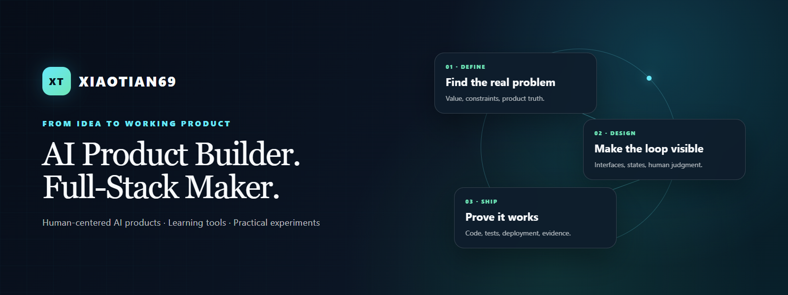

  <a href="#what-i-build--我在做什么">What I build</a> ·
  <a href="#featured-projects--精选项目">Featured projects</a> ·
  <a href="#how-i-work--我的工作方式">How I work</a>

I design and build AI-native products from problem framing to working software.

我关注 AI 原生产品，也把产品定义、交互设计和完整工程实现连接起来。

## What I build / 我在做什么

I like products where AI is part of a clear user workflow—not a feature pasted onto the side. My projects currently explore private AI companionship, structured learning, mathematical modeling, immersive H5 interaction, and small automation tools.

我偏爱有清晰用户闭环的 AI 产品：模型能力要进入真实流程，也要把隐私、失败回退、人工判断和可验证性设计进去。

## Featured projects / 精选项目

| Project | What it does | Stack |
| --- | --- | --- |
| **[Luna AI Companion](https://github.com/Xiaotian69/luna-ai-companion)** | A self-hostable Chinese AI companion with streaming conversation, inspectable long-term memory, and natural voice. 可自托管的中文 AI 陪伴产品，强调流式对话、透明长期记忆与自然语音。 | TypeScript · React · Cloudflare |
| **[Study Bench](https://github.com/Xiaotian69/study-bench)** · [Live](https://study-bench.vercel.app) | A guided learning workbench that connects textbook reading, questions, practice, and feedback. 把教材阅读、提问、练习与反馈连成完整学习闭环。 | Next.js · React · KaTeX |
| **[ModelingBridge](https://github.com/Xiaotian69/modelingbridge)** · [Live](https://modelingbridge.vercel.app) | An AI-guided mathematical modeling workflow for beginners, from framing to validation. 面向初学者的 AI 引导式数学建模流程，从问题定义走到结果检验。 | TypeScript · React · FastAPI |
| **[Mystic Destiny](https://github.com/Xiaotian69/mystic-destiny)** · [Live](https://xiaotian69.github.io/mystic-destiny/) | An immersive Chinese astrology and tarot H5 experiment with optional AI interpretation. 融合中式命理、塔罗与可选 AI 解读的沉浸式 H5 交互实验。 | JavaScript · Cloudflare Workers · GitHub Pages |

## More projects / 更多项目

| Project | Purpose / 用途 |
| --- | --- |
| [Python Exam Practice](https://github.com/Xiaotian69/python-exam-practice) · [Live](https://xiaotian69.github.io/python-exam-practice/) | 151-question browser practice set with Pyodide coding exercises / 含 Pyodide 编程题的 151 题浏览器练习工具 |
| [Shanxi Caijing Exams](https://github.com/Xiaotian69/shanxi-caijing-exams) | Searchable, manifest-backed study-material index with integrity hashes / 带清单与完整性哈希的可检索学习资料索引 |
| [Unipus Popup Clicker](https://github.com/Xiaotian69/unipus-popup-clicker) | A local browser utility for dismissing repetitive study-session popups / 用于处理重复学习弹窗的本地浏览器小工具 |

## Stoneframe / 石间

一次大同摄影，延伸出一组复古拼贴作品，也留下两份可以复用的创作工具。

| 摄影原片 | 拼贴作品 · 朱焰 |
| :---: | :---: |
|  |  |

**[浏览石间作品与 Skills](skills/)** · [11 张作品与原片参考](skills/checked-collage-panel-extractor/examples/GALLERY.md)

- **[Stoneframe · 石间拼贴](skills/heritage-photo-collage/)**：从摄影中选主体，设计配色、构图与图像编辑提示词。
- **[PanelPick · 勾选拆图](skills/checked-collage-panel-extractor/)**：在联系表上勾选作品，导出单张图片与 ZIP。

Heritage photography, visual collage, and reusable skills for making and selecting images.

## How I work / 我的工作方式

- **Start with the product truth.** I separate implemented behavior from ideas, then make the value proposition concrete.
- **Build the real interface.** I prefer runnable flows and representative states over concept-only mockups.
- **Design the boundaries.** Privacy, credentials, local data, AI fallbacks, and human confirmation are part of the product.
- **Verify before presenting.** Tests, production builds, link checks, screenshots, and deployment checks support the claims.

- **先确认产品事实**：区分已实现能力与设想，再提炼清楚的价值主张。
- **交付真实界面**：优先做可运行的流程与有代表性的产品状态。
- **把边界也设计进去**：关注隐私、密钥、本地数据、AI 回退与人工确认。
- **展示前先验证**：用测试、构建、链接、截图与部署检查支撑产品描述。

## Stack / 技术栈

`TypeScript` · `React` · `Next.js` · `Python` · `FastAPI` · `Cloudflare` · `Vercel` · `GitHub Actions` · `Playwright` · `Vitest` · `pytest`

Building practical AI products, one verified loop at a time. / 持续把 AI 想法做成可验证、可使用的产品。

