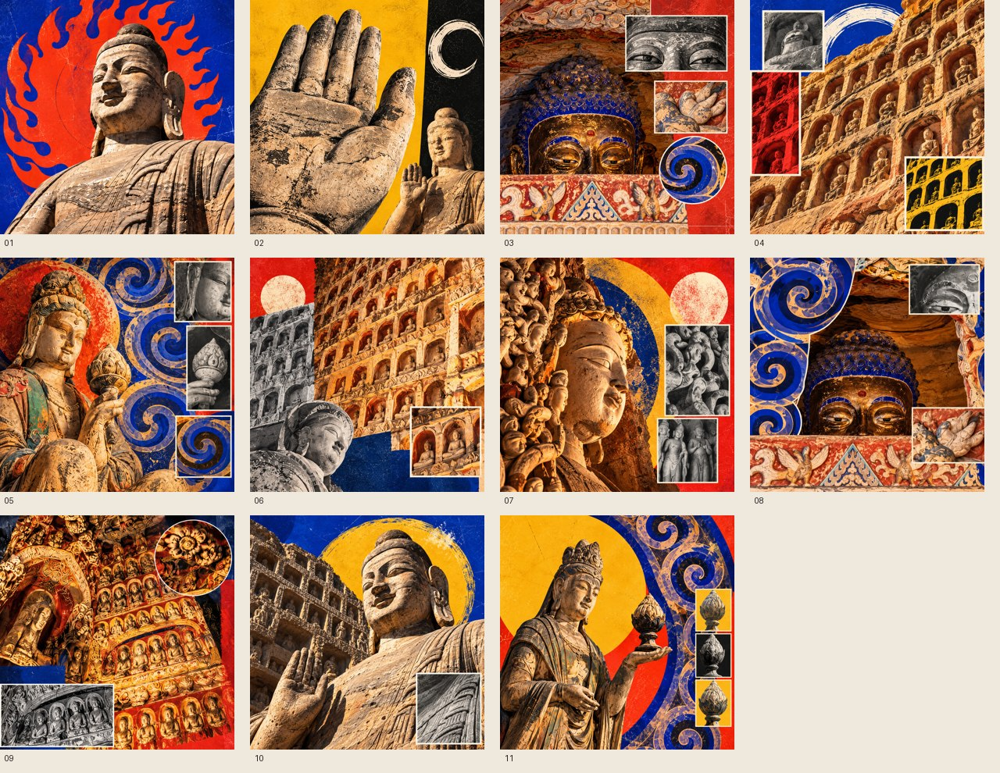
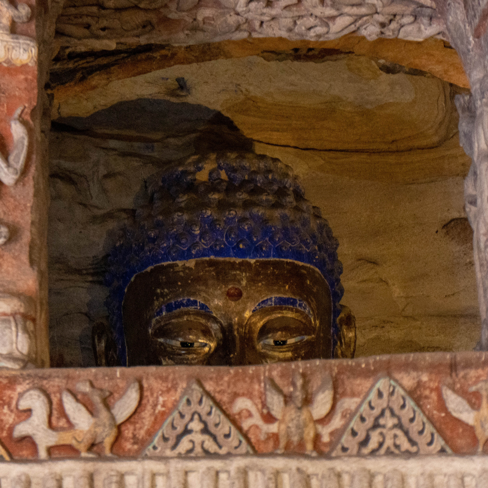
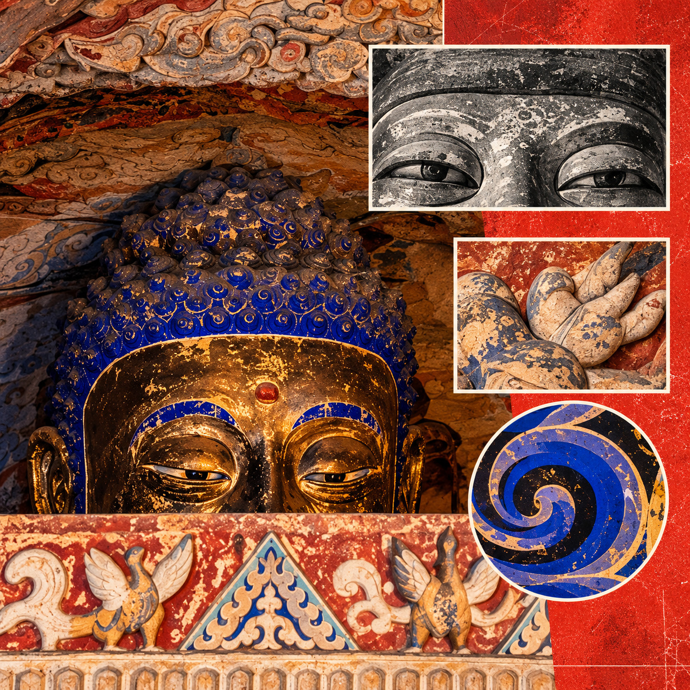

# 石间 · Stoneframe

**从石窟摄影，走向拼贴海报。**

复古色块、真实石纹、局部回声。 
一组用于摄影再创作与选图导出的开放 Skills。

[浏览作品](checked-collage-panel-extractor/examples/GALLERY.md) · [开始创作](heritage-photo-collage/) · [勾选拆图](checked-collage-panel-extractor/)

石间来自一次大同摄影实践。佛像的风化、佛龛的重复、彩绘的剥落，为画面提供了现成的形状与纹理；群青、朱红和金黄，则把它们组织成新的海报。

这里分享 11 张作品、7 张摄影参考，以及两份可用于自己素材的 skill：一份帮助构思和制作拼贴，一份把选中的成品从联系表中拆出来。

## 原片与拼贴

| 摄影原片 | AI 拼贴 |
| :---: | :---: |
|  |  |

**朱焰**：从石像与岩壁出发，以群青背景和朱红光环强化轮廓，让主体更集中。

| 摄影原片 | AI 拼贴 |
| :---: | :---: |
|  |  |

**窟中金面**：以窟口中的面孔为主视觉，把眼部、彩绘和卷纹组织成局部回声。

更多对比见 [完整作品集](checked-collage-panel-extractor/examples/GALLERY.md)。原片为视觉核对的摄影参考，作品包含 AI 改绘。

## 选一个起点

| 你想做什么 | 使用哪个 skill |
| --- | --- |
| 为自己的照片选片、设计构图、写提示词 | [Stoneframe · 石间拼贴](heritage-photo-collage/) |
| 有了设计方案，制作约定数量的海报 | [Stoneframe · 石间拼贴](heritage-photo-collage/)；需要可用的图像生成工具 |
| 在拼图上勾选作品，导出单张和压缩包 | [PanelPick · 勾选拆图](checked-collage-panel-extractor/) |
| 先了解风格和摄影素材 | [作品集与原片参考](checked-collage-panel-extractor/examples/GALLERY.md) |

## 从自己的照片开始

把需要的 skill 文件夹放入客户端的 skills 目录，然后给它照片或可读取的摄影目录。下面这段指令适合先做方案：

> 为这批照片挑选 6 张：3 张做超现实波普，3 张做梦核拼贴。逐张给出主体、配色、构图和可直接使用的提示词。只整理方案与工作副本，本轮不生成图片。

已经有了满意的拼图，可以接着说：

> 按我画的青色勾选标记，从对应的无标记拼图拆出 11 张。输出 1:1 图片和 ZIP，保留每张作品内部的白框与细节。

两份 skill 可以分别安装，也可以用于同一次创作。各自的 README 提供安装方法和完整示例。

## 关于作品

摄影与作品由 [Xiaotian69](https://github.com/Xiaotian69) 提供。图库展示的是已有 AI 拼贴作品；创作指南是对其视觉方法的整理。拆图脚本使用本地裁切，不调用图像生成。

代码与文档采用 MIT 许可。图片格式、摄影参考关系与来源记录见 [图库说明](checked-collage-panel-extractor/examples/GALLERY.md#素材说明)。

---

**English** — Stoneframe is a small collection of skills for turning heritage photography into visual collages and exporting selected panels from contact sheets. Explore the eleven artworks, start with your own photographs, or use PanelPick to crop checked panels from a matching clean sheet.
